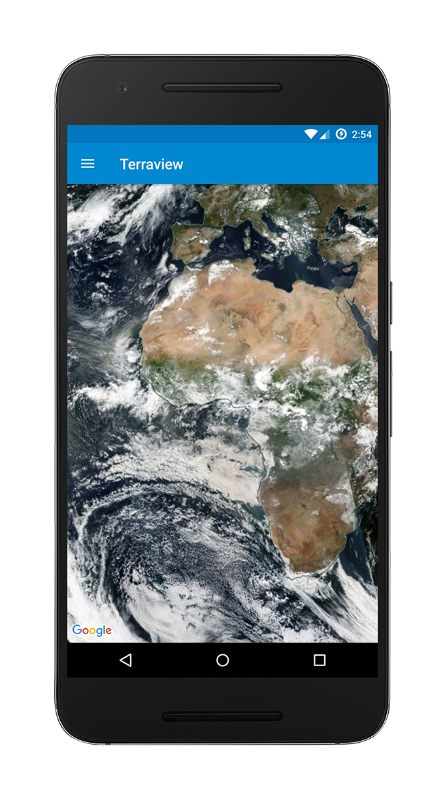
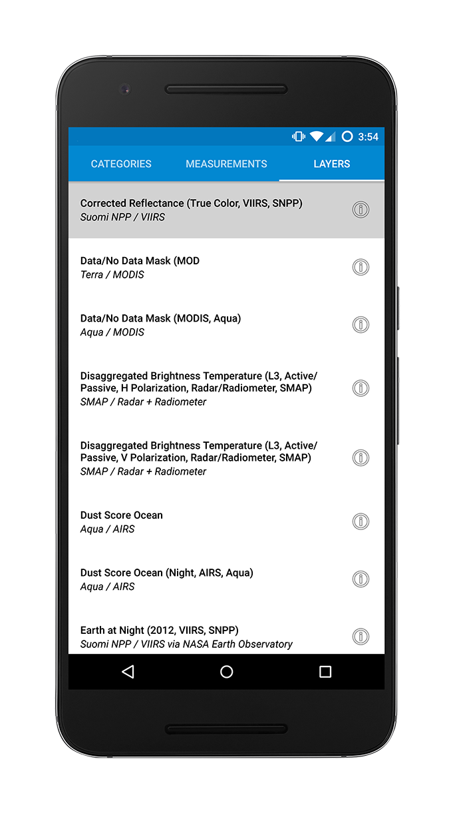
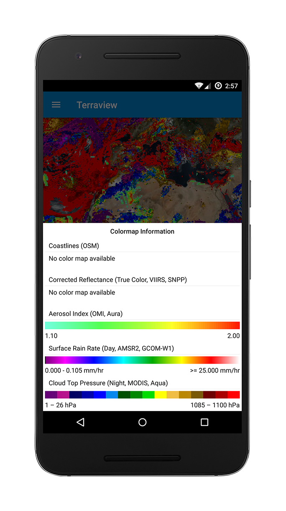

# Terraview
 
Terraview is a REST client for NASA's [Global Imagery Browse Services](https://earthdata.nasa.gov/gibs) (GIBS).
GIBS is a public API providing access to satellite data and imagery from the EOS (Earth Observing System) and A-Train satellites.
While this application is not directly related to NASA's [Worldview](https://worldview.earthdata.nasa.gov),
I worked on improvements on the project in an internship in NASA's Goddard Space Flight Center and created this based on the idea a better interface could be made for mobile devices.

## Highlights
* Implemented with MVP (model view presenter) architecture, with ViewModel to persist current data. MVVM implementation in progress
* Google Maps API used to present web tile imagery from GIBS
* Room library used for database and to create many-to-many relationships among the data
* Retrofit 2 used for networking to convert JSON and XML endpoints to ordinary interfaces
* RxJava used to implement an event bus and to coordinate asynchronous queries with Room and Retrofit APIs
* TapTargetView used to create a simple app tour
* RecyclerView list with support for dragging and swiping items
* Visualization of Colormaps for supported overlay layers
* Autocomplete search feature for layer picker UI with custom ContentProvider
* Metadata is obtained and parsed from Worldview, licensed under [NASA's open source license] (https://worldview.earthdata.nasa.gov/pages/license.html)

## Testing Highlights
* Unit tests for the Presenters and instrumentation tests for Room data access objects (DAOs)
* Espresso tests for the map and animation dialog UI
* Mockito framework used to mock the Views
* Mockito doAnswer-when idiom used for mock implementation of Retrofit APIs
* Dependency injection throughout the app to make testing viable

## Screenshots

	
## Libraries
* [Android Architecture Components] (https://developer.android.com/topic/libraries/architecture/)
* [Google Maps API for Android](https://developers.google.com/maps/android/)
* [RxJava 2](https://github.com/ReactiveX/RxJava) and [RxAndroid 2](https://github.com/ReactiveX/RxAndroid)
* [Retrofit 2](http://square.github.io/retrofit/)
* [Simple XML](http://simple.sourceforge.net/)
* [Gson](https://github.com/google/gson)
* [OkHttp3](http://square.github.io/okhttp/)
* [Espresso](https://google.github.io/android-testing-support-library/docs/espresso/index.html)
* [Mockito](http://mockito.org/)
* [TapTargetView](https://github.com/KeepSafe/TapTargetView/)

## Requirements
Replace the API key value with your own API key. You may also use the mockDebug build variant.

## Helpful Tutorials and samples I used:
* [RecyclerView drag and swipe tutorial](https://medium.com/@ipaulpro/drag-and-swipe-with-recyclerview-b9456d2b1aaf#.hhn9yujya)
* [TODO-MVP samples](https://github.com/googlesamples/android-architecture/tree/todo-mvp)
* [Event Bus with RxJava tutorial](http://blog.kaush.co/2014/12/24/implementing-an-event-bus-with-rxjava-rxbus/)
* [Android MVP Unit Testing](http://verybadalloc.com/android/adding-unit-tests-to-MVP-project.html)
* [Testing RecyclerView with Espresso](https://spin.atomicobject.com/2016/04/15/espresso-testing-recyclerviews/)
* [RxJava Android Samples](https://github.com/kaushikgopal/RxJava-Android-Samples)
* [Google I/O app repository](https://github.com/google/iosched)
* [GIBS API for Developers](https://wiki.earthdata.nasa.gov/display/GIBS/GIBS+API+for+Developers)

## Acknowledgements
We acknowledge the use of imagery provided by services from the Global Imagery Browse Services (GIBS), operated by the NASA/GSFC/Earth Science Data and Information System (ESDIS, [https://earthdata.nasa.gov](https://earthdata.nasa.gov)) with funding provided by NASA/HQ.