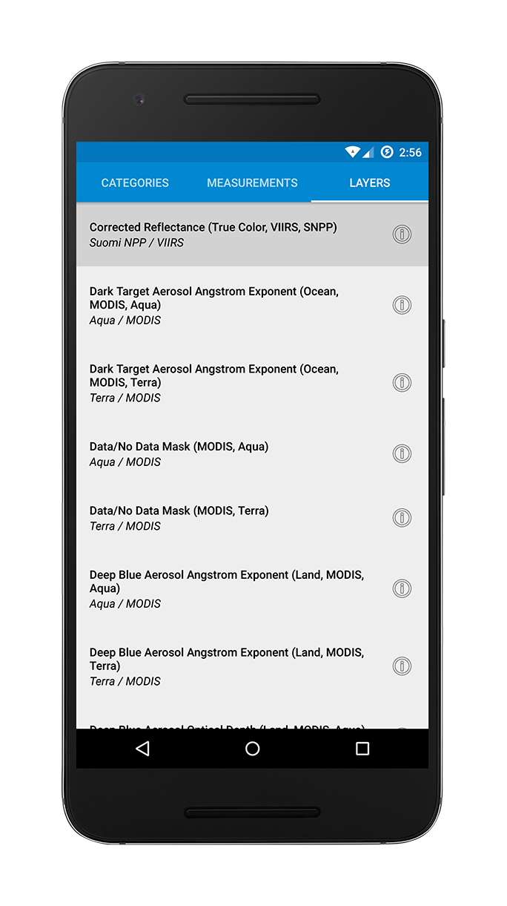

# Terraview
 
Terraview is a REST client for NASA's [Global Imagery Browse Services](https://earthdata.nasa.gov/gibs) (GIBS).
GIBS is a public API providing access to satellite data and imagery from the EOS (Earth Observing System) and A-Train satellites.
While this application is not directly related to NASA's [Worldview](https://worldview.earthdata.nasa.gov),
I worked on improvements on the project in an internship in NASA's Goddard Space Flight Center and created this based on the idea a better interface could be made for mobile devices.

## Decisions
* Code is split by feature under Model-View-Presenter Architecture
	I started this application by implementing core features within the Activities and Fragments. There are still features to be implemented which will lead to code bloat. Recently I underwent the process of converting to MVP to seperate business logic from the view to simplify the logic needed in the Activities and Fragments. In the layer picker feature, the event bus has been greatly simplified as a result to minimize coupling. There are instructmentation and unit tests to demonstrate MVP testing and code coverage. Over time I like to improve the MVP structure to create more meaningful tests, but due to dependency on Google Maps this is not very feasable.

* RxJava is used to create an event bus and to perform networking tasks
	Currently the ViewPager which accepts fragments to "page" through them in tabs does not allow communication through each of these fragments. 
	The app needs a way to determine what category is selected to display the corresponding measurements in the next tab, and finally the revelant layers in the final tab. This is handled by creating an event bus in RxJava allowing the activities and fragments to have their own reference to the same event bus instance to post and consume events.
	Observables and subscribers are also used to pass Retrofit calls to background threads and the response bodies may be subscribed upon back in the main thread. They allow tasks to run in timed intervals to make animations possible.

* Retrofit is used to obtain HTML of layer information and parse XML
    When selecting layers in the Worldview application, information and sources are displayed.
    This is found in a web page. I simplified the process of generating the URLs by creating my own API interface to use with Retrofit. No converter is used, the raw ResponseBody HTML object is returned and shown to the user.
	Retrofit is also used in conjunction with the Simple XML framework to parse XML of colormaps data due to its consistent structure for each supported layer. 

* Metadata is obtained and parsed from Worldview
    Worldview's metadata may be found in the wv.json file, and contains more metadata on the layers and categories compared to
    the [WMTSCapabilities.xml](http://map1.vis.earthdata.nasa.gov/wmts-webmerc/1.0.0/WMTSCapabilities.xml) file made available to developers who want to use GIBS's REST endpoints.
    Worldview is licensed under [NASA's open source license] (https://worldview.earthdata.nasa.gov/pages/license.html), I believe this is an appropriate use of the metadata.

## Screenshots

	
## Libraries
* [Android Architecture Components] (https://developer.android.com/topic/libraries/architecture/)
* [Google Maps API for Android](https://developers.google.com/maps/android/)
* [RxJava 2](https://github.com/ReactiveX/RxJava) and [RxAndroid 2](https://github.com/ReactiveX/RxAndroid)
* [Retrofit 2](http://square.github.io/retrofit/)
* [Simple XML](http://simple.sourceforge.net/)
* [Gson](https://github.com/google/gson)
* [OkHttp3](http://square.github.io/okhttp/)
* [Espresso](https://google.github.io/android-testing-support-library/docs/espresso/index.html)
* [Mockito](http://mockito.org/)
* [TapTargetView](https://github.com/KeepSafe/TapTargetView/)

## Requirements
Replace the API key value with your own API key. You may also use the mockDebug build variant.

## Helpful Tutorials and samples I used:
* [RecyclerView drag and swipe tutorial](https://medium.com/@ipaulpro/drag-and-swipe-with-recyclerview-b9456d2b1aaf#.hhn9yujya)
* [TODO-MVP samples](https://github.com/googlesamples/android-architecture/tree/todo-mvp)
* [Event Bus with RxJava tutorial](http://blog.kaush.co/2014/12/24/implementing-an-event-bus-with-rxjava-rxbus/)
* [Android MVP Unit Testing](http://verybadalloc.com/android/adding-unit-tests-to-MVP-project.html)
* [Testing RecyclerView with Espresso](https://spin.atomicobject.com/2016/04/15/espresso-testing-recyclerviews/)
* [RxJava Android Samples](https://github.com/kaushikgopal/RxJava-Android-Samples)
* [Google I/O app repository](https://github.com/google/iosched)
* [GIBS API for Developers](https://wiki.earthdata.nasa.gov/display/GIBS/GIBS+API+for+Developers)

## Acknowledgements
We acknowledge the use of imagery provided by services from the Global Imagery Browse Services (GIBS), operated by the NASA/GSFC/Earth Science Data and Information System (ESDIS, [https://earthdata.nasa.gov](https://earthdata.nasa.gov)) with funding provided by NASA/HQ.